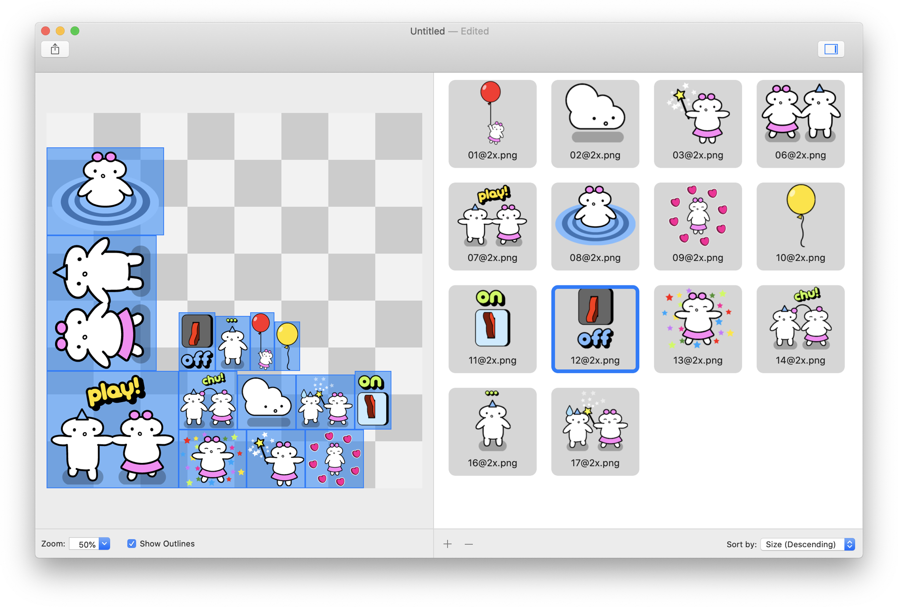

# MuMuEngine Atlas Editor

Texture atlas (a.k.a. 'spritesheet') editor that outputs resources in a format compatible with the [MuMuEngine](https://github.com/nicolas-miari/MuMuEngine).

### Screenshots

